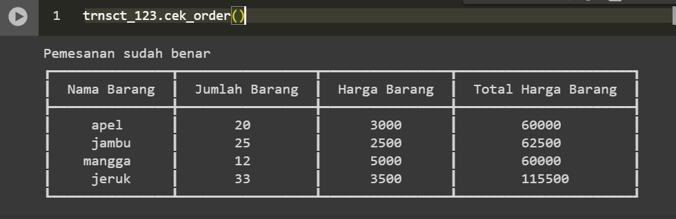

# self-cashier-sederhana
# Latar Belakang Masalah
Andi adalah seorang pemilik supermarket. Beliau ingin memperbaiki proses bisnis di supermarket miliknya, yaitu dengan membuat sistem kasir self-service agar customer bisa langsung menginputkan barang yang dibelinya saat ingin melakukan pembayaran secara mandiri. Hal ini dilakukan agar customer yang berada di luar kota juga bisa membeli barang dari supermarket tersebut.
Untuk memecahkan masalah tersebut adalah dengan membuat program Cashier Self-Service untuk memperbaiki proses bisnis di supermarket milik Andi.

# Objective
Tujuan dari pembuatan projek ini adalah membuat sistem kasir self-service yang dapat melakukan beberapa metode yaitu:

1.	Customer dapat menginput barang, jumlah barang, dan juga harga barang dengan metode `tambah_barang()`.

2.	Jika customer salah input, ia dapat mengubah salah satu inputanya:

    •	mengubah nama barang dengan metode `update_nama_barang()`.
  	
    •	mengubah jumlah barang dengan metode `update_jumlah_barang()`.
  	
    •	mengubah harga barang dengan metode `update_harga_barang()`.

4.	Jika customer ingin menghapus salah satu barang dari daftar barang belanjanya, dapat menggunakan metode `hapus_barang()`.

5.	Jika customer ingin menghapus semua barang dari daftar belanjanya, dapat menggunakan metode `reset_transaction()`

6.	Sebelum dapat menghitung total belanjanya, isi dari daftar belanja customer dicek dulu dengan metode `cek_order()`. Metode ini mengecek apakah ada inputan yang masih salah pada daftar barang belanja customer.

7.	Sistem dapat menghitung semua total belanja dan juga diskon yang didapatkannya dengan metode `total_belanja()`.

8.	Ketentuan untuk memperoleh diskon:

    •	Jika total belanja diatas **Rp.500.000**, maka diskon **10%**
  	
    •	Jika total belanja diatas **Rp.300.000**, maka diskon **8%**
  	
    •	Jika total belanja diatas **Rp.200.000**, maka diskon **5%**

# Method yang digunakan

1.	`Transcaction()`
   
    Membuat kelas transaksi untuk menghimpun data transaksi dan membuat fungsi/method sehingga menghasilkan objek

2.	`tambah_barang()` (self, nama_barang, jumlah_barang, harga_barang)
   
  	Metode ini digunakan untuk memasukkan barang ke daftar barang belanja.

3.	`update_nama_barang()` (self, nama_barang, nama_barang_baru)

  	Metode ini digunakan untuk merubah nama barang yang sudah ada dalam daftar barang belanja.

4.	`update_jumlah_barang()` (self, nama_barang, jumlah_barang_baru)

  	Metode ini digunakan untuk merubah jumlah barang berdasarkan nama barang yang ada didalam daftar barang belanja.

5.	`update_harga_barang()` (self,nama_barang,jumlah_barang_baru)

  	Metode ini digunakan untuk merubah harga barang berdasarkan nama barang yang ada didalam daftar barang belanja.

6.	`hapus_barang()` (self,nama_barang)

  	Metode ini digunakan untuk menghapus salah satu barang yang diinginkan berdasarkan nama barang yang ada didalam     `daftar barang belanja

7.	`reset_transaction()`

   	Metode ini digunakan untuk menghapus semua barang didalam daftar barang belanjaan.

8.	`cek_order()`

   	Metode ini digunakan untuk memastikan data yang diinputkan sudah benar atau belum.

9.	`total_belanja()`

   	Metode ini digunakan untuk menghitung total harga dari daftar barang belanja customer.

# FLOWCHART

# ALUR PROGRAM
1.	Customer membuat ID transaksi dengan membuat objek dari class trnsct_123 = Transaction()
   
2.	Customer memasukkan nama barang, jumlah, barang, dan harga barang
   
3.	kemudian dicek apakah ada kesalahan inputan, jika ada kesalahan inputan tapi tidak ingin menghapus barangnya,

  	maka customer dapat melakukan salah satu dari method dibawah:
  	
        o	update nama barang dengan method update_nama_barang()
  	
        o	update jumlah barang dengan method update_jumlah_barang()
  	
        o	update harga barang dengan method update_harga_barang()
  	
4.	Jika customer ingin membatalkan salah satu barang, customer dapat menghapus salah satu barang dengan method
  
	hapus_barang, ketika menghapus salah satu item maka jumlah barang dan harga barang ikut terhapus.

5.	Jika customer ingin menghapus semua barang di daftar barang, yaitu menggunakan method reset_transaction()
   
6.	Apabila customer sudah selesai belanja online, tapi masih ragu apakah inputannya sudah benar atau belum, maka

  	customer dapat menggunakan method cek_order dan mengeluarkan pesan "pemesanan sudah benar" jika tidak ada

  	kesalahan input. Jika ada kesalahan input maka mengeluarkan pesan "terdapat kesalahan input data.
  	
7.	Setelah melakukan pengecekan, customer dapat menghitung total belanja dengan method total_belanja() dengan           ketentuan:
        o	jika total belanja > 500_000 maka dapat diskon 10%
        o	jika total belanja > 300_000 maka dapat diskon 8%
        o	jika total belanja > 200_000 maka dapat diskon 5%

# METHOD UPDATE TAMBAH BARANG

# METHOD UPDATE NAMA BARANG

# METHOD UPDATE JUMLAH BARANG

# METHOD UPDATE HARGA BARANG

# METHOD HAPUS BARANG

# METHOD RESET TRANSACTION

# METHOD CEK ORDER

# METHOD TOTAL BELANJA

